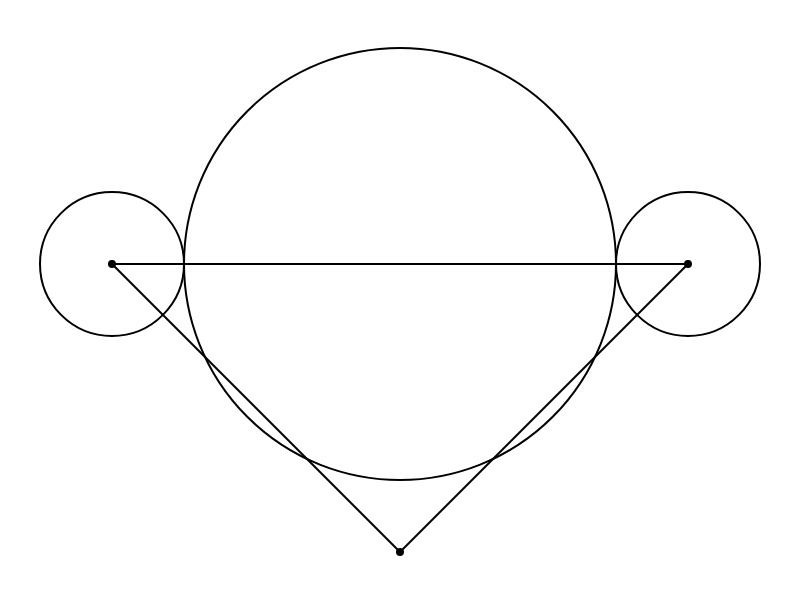
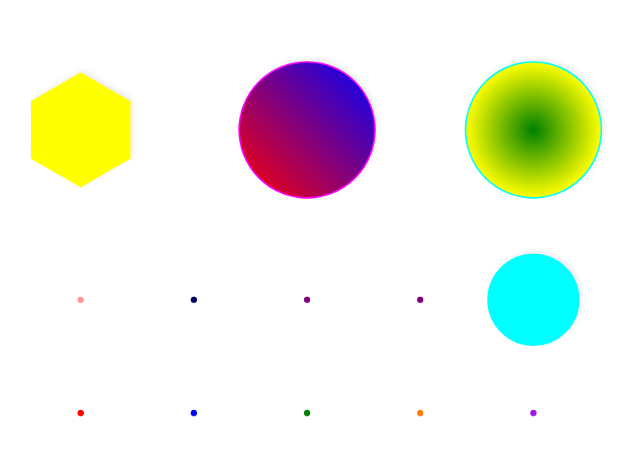
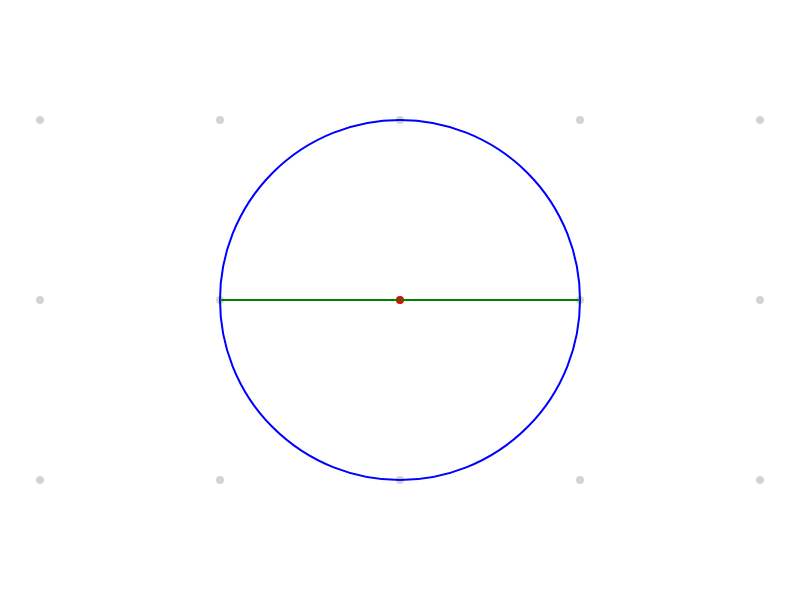
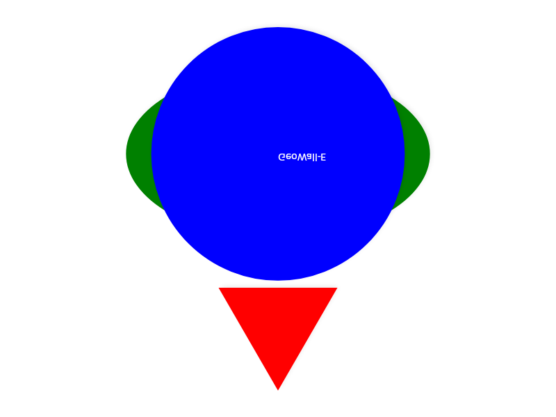

# GeoWall-E

[](https://github.com/LiaLopezRosales/WALL-E/actions/workflows/ci.yml)

**GeoWall-E** is a geometric drawing interpreter for a small DSL: write short programs (points, lines, circles, sequences, functions) and render them on a canvas. Pipeline: **Lexer → Parser → Evaluator → Canvas**.



## Quick start

```bash
# Build everything
dotnet build src/Wall-E.sln

# Render a .geo file to PNG
dotnet run --project src/Wall-E.CLI -- GeoLibrary/basic.geo output.png

# Render to SVG
dotnet run --project src/Wall-E.CLI -- GeoLibrary/colors.geo output.svg

# Custom resolution
dotnet run --project src/Wall-E.CLI -- GeoLibrary/samples.geo output.png --width 1200 --height 800

# Run tests
dotnet test tests/Wall-E.Application.Tests/Wall-E.Application.Tests.csproj    # 227 tests
dotnet test tests/Wall-E.Domain.Tests/Wall-E.Domain.Tests.csproj              # 68 tests
dotnet test tests/Wall-E.UI.Tests/Wall-E.UI.Tests.csproj                      # 6 tests
```

## DSL examples

```geo
// Points, lines, circles
A = point(100, 300);
B = point(300, 100);
draw line(A, B);
draw circle(point(200, 200), 80) "circle";

// Colors and fills
color red;
fill;
draw polygon(point(300, 300), 120, 6) "hexagon";
fill linear(red, blue);
draw circle(point(300, 300), 60) "gradient";

// Loops and functions
f(x) = x * x;
repeat(5) { draw circle(point(300, 300), f(30)); }
```



## Features

| Category | Features |
|---|---|
| **Figures** | `point`, `line`, `segment`, `ray`, `circle`, `arc`, `polygon`, `ellipse` |
| **Draw** | `draw fig;`, `draw fig "label";`, `label(pos, "text", size)` |
| **Colors** | 148 CSS names, `rgb()`, `rgba()`, `hsl()`, hex `#RGB`/`#RRGGBB`/`#RRGGBBAA` |
| **Chromatic ops** | `lighten(n)`, `darken(n)`, `mix(color, ratio)`, `complement()` |
| **Fills** | `fill`, `unfill`, `fill linear(c1, c2)`, `fill radial(c1, c2)` |
| **Styles** | `dashed`, `dotted`, `dashdot`, `solid`, `grosor(n)` |
| **Control flow** | `repeat(n) {…}`, `for i in seq {…}`, `if(cond) {…}` |
| **Functions** | `f(x) = expr;`, `let x = expr in expr` |
| **Sequences** | `{1,2,3}`, `seq s = a..b`, `randoms`, `points`, `samples` |
| **Math** | `sin`, `cos`, `sqrt`, `abs`, `floor`, `ceil`, `phi`, `sqrt2`, `PI` |
| **Organization** | `layer n`, `hide label`, `show label`, `snap n` |
| **I/O** | `print(expr)`, `seed(n)`, `import "file"` |
| **Export** | PNG and SVG via CLI headless renderer |



## Project structure

| Project | Path | Description |
|---|---|---|
| **Wall-E.Domain** | `src/Wall-E.Domain/` | AST, figures, evaluation — zero external deps |
| **Wall-E.Application** | `src/Wall-E.Application/` | Lexers, parsers, pipeline orchestrator |
| **Wall-E.Infrastructure** | `src/Wall-E.Infrastructure/` | File system, GeoLibrary loader |
| **Wall-E.CLI** | `src/Wall-E.CLI/` | Headless renderer (PNG/SVG via SkiaSharp) |
| **Wall-E.UI.Avalonia** | `src/Wall-E.UI.Avalonia/` | Desktop UI (Avalonia 11 + SkiaSharp) |
| **Wall-E (legacy)** | `Wall-E.csproj` | WinForms app (Windows only) |

Three test suites:

| Suite | Tests | What it covers |
|---|---|---|
| `Wall-E.Application.Tests` | 227 | Full pipeline characterization + lexer/parser isolated |
| `Wall-E.Domain.Tests` | 68 | Domain unit tests (ColorTable, HSL, Result monad, intersections) |
| `Wall-E.UI.Tests` | 6 | MainViewModel tests (Avalonia.Headless) |

Line coverage is measured with Coverlet and gated at **>40%** in CI
(`Wall-E.Application.Tests` run: Domain 50.7%, Application 76.7%, combined 60.9%).



## Build & test

```bash
export PATH="$HOME/.dotnet:$PATH"  # dotnet SDK is at ~/.dotnet

dotnet build src/Wall-E.sln                     # build all new-arch projects
dotnet test tests/Wall-E.Application.Tests/...   # 227 characterization tests
dotnet test tests/Wall-E.Domain.Tests/...        # 68 domain unit tests
dotnet test tests/Wall-E.UI.Tests/...            # 6 viewmodel tests (headless)
```

CI runs on every push (`.github/workflows/ci.yml`, ubuntu, Release): build + all
tests, plus a coverage job that fails under 40% line coverage.

## Sample files

| File | Description |
|---|---|
| [`GeoLibrary/basic.geo`](GeoLibrary/basic.geo) | Basic shapes: points, lines, circles, segments |
| [`GeoLibrary/colors.geo`](GeoLibrary/colors.geo) | Full color system: CSS names, HSL, gradients |
| [`GeoLibrary/grid.geo`](GeoLibrary/grid.geo) | Grid with layers, snap, hide/show |
| [`GeoLibrary/samples.geo`](GeoLibrary/samples.geo) | Polygons, ellipses, concentric circles |

## Documentation

| Document | Contents |
|---|---|
| [`AGENTS.md`](AGENTS.md) | Architecture, conventions, DSL semantics |
| [`ROADMAP.md`](ROADMAP.md) | Implementation plan (M6–M12) |
| [`MIGRATION_LOG.md`](MIGRATION_LOG.md) | Evaluator migration record |
| [`DEBT_SPRINT.md`](DEBT_SPRINT.md) | Post-migration debt sprint |

---

## Español

**GeoWall-E** es un intérprete de dibujo geométrico para un lenguaje pequeño: se escriben programas cortos (puntos, segmentos, circunferencias, secuencias, funciones) y se grafican en una pizarra. Pipeline: **Lexer → Parser → Evaluator → Canvas**.

### Arquitectura

La nueva arquitectura sigue Clean Architecture con dirección de dependencia estricta (**Infrastructure → Application → Domain**, cero dependencias externas en Domain). Reemplaza el evaluator monolítico legacy con el patrón Visitor y registros sellados `Result<T,E>`.

### El lenguaje DSL

- **Puntos con coordenadas**: `A = point(100, 200);` o `draw point(100, 200);`
- **Operaciones matemáticas**: `+`, `-`, `*`, `/`, `^`, `%` con precedencia estándar.
- El símbolo `;` determina el fin de una instrucción.
- `{secuencia} + undefined` devuelve la primera secuencia sin cambios (comportamiento de concatenación, por diseño).
- Los errores informan tipo, explicación y localización (archivo, línea y columna).
- El procesamiento es por etapas: tokenizado → parseo → evaluación.
- **Exportar PNG/SVG**: `dotnet run --project src/Wall-E.CLI -- archivo.geo salida.png`
